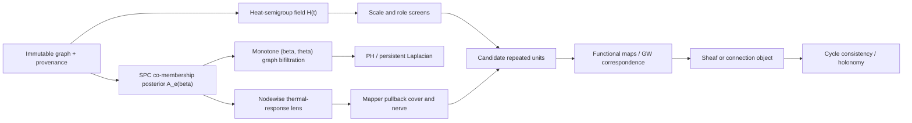
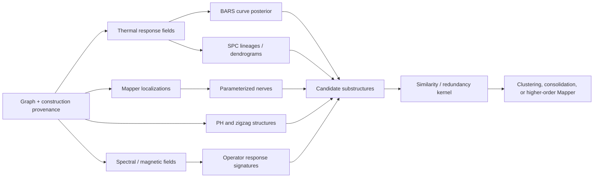

# Review HOPE and Hilbert concepts

> I came across an interesting paper released recently about this "HOPE" method involve hilbert operators and connected it to my own work in thermomapper involving superparamagnetic clustering, topology/ph, mapper and other things i've developed or have thought about previously, as well as some other works that have informed my work on this project. `D:\aghado01\ThermoMapper\issues\hilbert\*.md`. Was wondering if you could do a deep dive review of the concepts, reading the documents in order they were created and offer any feedback or additional synthesis insights

4 previous messages

> I’ll read the Hilbert notes in filesystem creation order, trace how the ideas evolve, and then pressure-test the HOPE/SPC/PH/Mapper connections against the project’s architectural invariants. I’ll also follow any primary references the notes rely on where that materially sharpens the review.
>
> The arc is coherent, but several of its most exciting bridge claims need a stricter distinction between “structural analogy” and “mathematical equivalence.” I’m now checking those seams—especially whether the SPC temperature sweep really defines a filtration/Mapper construction, whether repetition produces the proposed heat-entropy signature, and what the current code actually guarantees.
>
> 

Searched the web

>
> Searched the web for `site:arxiv.org/abs/2607.21366 Hilbert Operator Progressive Encoding HOPE ...`
>
> Searched the web for `site:arxiv.org "Multiscale Mapper" interleaving ...`
>
> Searched the web for `multiscale mapper towers of covers interleaving distance paper Dey Mémoli Wang ...`
>
> Searched the web for `Laplacian Renormalization Group network entropy susceptibility specific heat graph scale invariance paper ...`
>
> Searched the web for `site:arxiv.org heat kernel signature graph isomorphism Weisfeiler Lehman vertices cospectral limitations ...`
>
> Searched the web for `Dey Mémoli Wang Multiscale Mapper Topological Summarization via Codomain Covers arxiv ...`
>
> 

>
> The strongest new conclusion is that the repo already contains the mathematically honest version of the SPC–PH bridge: the posterior/expected edge co-membership field over inverse temperature, thresholded into a monotone graph bifiltration. That is stronger than calling SPC “thermal single-linkage,” and it also exposes exactly where Mapper must enter separately—as a pullback cover of a nodewise thermal lens, not merely the nerve of the temperature partitions.

Overall, this is a genuinely fertile line of thought. The durable center is not “Hilbert spaces everywhere”; it is:

> Represent an object by what it does under a declared measure, study the resulting operator-valued trajectory across scale, and postpone identity claims until correspondence and external validation have entered.

That principle fits HOPE, heat flow, SPC, PH, and Mapper remarkably well. The notes become less reliable when they promote a structural analogy into an equivalence—particularly around filtrations, Mapper, repetition detection, and posterior resolution.

## How the arc developed

The recoverable creation order is:

1. [claude-HOPE-paper-analysis.md](./issues/hilbert/claude-HOPE-paper-analysis.md) — functional identity and measure-relative neuron geometry.
2. [claude-hilbert-synthesis.md](./issues/hilbert/claude-hilbert-synthesis.md) — HOPE × NLD × ThermoMapper; behavioral identity and the `(gauge, measure, metric)` audit.
3. [claude-heat-semigroup-engines.md](./issues/hilbert/claude-heat-semigroup-engines.md) — computational affordability, subgraph boundary conditions, correspondence.
4. [claude-repeated-units-bundles.md](./issues/hilbert/claude-repeated-units-bundles.md) — repetition as approximate symmetry, covers, bundles/sheaves, holonomy.
5. [claude-spc-repetition-thermal.md](./issues/hilbert/claude-spc-repetition-thermal.md) — abandoned 73-byte draft stub.
6. [claude-spc-repetition-nerve.md](./issues/hilbert/claude-spc-repetition-nerve.md) — first committed as the SPC/PH/Mapper synthesis, then extended with SPCX/BARS and corrected to interleaved uniform scheduling.

The first two entered Git together, but their NTFS timestamps establish their internal order. The final document’s Git history is itself informative: initial synthesis → SPCX layer → scheduling correction.

## What is strongest

The `(gauge, measure, metric)` audit is the best conceptual product of the arc. I would retain it, but expand it into an observation contract:

\[
(\text{domain/carrier},\ \text{gauge},\ \text{measure},\ \text{operator/metric},\ \text{estimator fidelity}).
\]

The added coordinates matter because:

- HOPE’s geometry depends on a surrogate measure and a neuron decomposition.
- Heat geometry depends on the Laplacian normalization and signal measure.
- SPC depends on the equilibrium estimand versus its finite-MC estimate.
- Mapper depends on a lens, codomain cover, and local clusterer.
- A GW coupling is an estimated correspondence, not merely another metric.

“Behavioral identity” is also worth promoting. The three examples are convincing:

- weights → function under a measure;
- adjacency → induced diffusion;
- cluster labels → co-membership relation.

The NLD paper really does define graph identity through integrated differences of Laplacian flows, under fixed node correspondence. [The original NLD paper](https://arxiv.org/abs/1810.02906) supports the notes’ high-level reading.

Likewise, the heat-engine factorization is excellent:

- matrix-function actions;
- declared graph-signal measure;
- sub-operator/boundary constructor;
- stochastic trace and spectral-density estimators.

That is a reusable neutral engine, provided it remains below PH/SPC/Mapper semantics in the dependency order.

## Where HOPE is more subtle than the notes suggest

The first reading correctly identifies the important contribution of the new [HOPE paper](https://arxiv.org/abs/2607.21366): function-space rather than parameter-space comparison, with pruning and merging expressed through low-rank projection.

But three caveats deserve more emphasis.

First, HOPE does not recover “actual functional identity”; it recovers identity relative to its surrogate measure. That is still valuable, but it is a fidelity rung.

More seriously, my inference from the paper’s stated MaxEnt covariance problem is that the global surrogate can be mathematically ill-posed when the BN constraint vectors do not span the input space. Maximizing `log det Σ` subject only to projected variance constraints leaves orthogonal directions unconstrained, so entropy can grow without bound. The paper avoids forming that covariance by using pairwise local surrogates, but then a new obligation appears:

> Do all pairwise covariances assemble into one positive-semidefinite global covariance—and do the approximate cross-kernels form a PSD Gram matrix?

If not, the calculations may be pairwise plausible without defining one coherent Hilbert geometry. This is exactly the kind of “declared measure must exist globally” check ThermoMapper’s vocabulary is well positioned to supply.

Second, Hilbert norm measures functional energy, not causal importance. A high-norm neuron can be cancellable; a low-norm neuron can be indispensable through synergy. Core/slack therefore requires external perturbation or downstream-task validation.

Third, progressive compression is not automatically persistent homology. Pure deletion gives a nested feature set. HOPE also merges neurons into new parents, so identities change and inclusion maps disappear. The honest object is more likely:

- a zigzag of representation spaces;
- a vineyard of Gram spectra/eigenspaces;
- or a correspondence-equipped trajectory.

“Long bars are core features” is a productive hypothesis, but currently a metaphor rather than a defined invariant.

## The heat/repetition section’s biggest mathematical correction

The notes propose:

- a flat entropy-susceptibility plateau for scale invariance;
- an isolated peak for repeated units.

The first part has literature support: the Laplacian RG work explicitly connects constant heat-derived specific heat with scale-invariant spectral structure. [Villegas et al.](https://www.nature.com/articles/s41567-022-01866-8)

The second part is not repetition-specific. For `m` disconnected identical copies,

\[
Z_m(t)=mZ_u(t),\qquad S_m(t)=S_u(t)+\log m,
\]

and therefore, for unnormalized entropy,

\[
-\frac{dS_m}{d\log t}=-\frac{dS_u}{d\log t}.
\]

Multiplicity adds an entropy offset; it does not create a new susceptibility peak. A peak can reveal a characteristic internal scale of the unit, but not that the unit is repeated. Weak coupling may split spectral bands and change the curve, yet that is a coupling effect, not a clean repetition theorem.

So the entropy curve should be retained as a scale screen, while repetition evidence should come from multiplicity-sensitive quantities:

- near-degenerate spectral bands;
- repeated local descriptors;
- synchronized thermal response curves;
- repeated hierarchy signatures;
- explicit correspondences.

## Heat computation and boundary semantics

The “actions, not matrices” strategy is right. A Chebyshev/Krylov basis can amortize sparse matrix-vector products over a time grid, although evaluating and storing every output time still has a cost.

The Frobenius relaxation also needs one clarification. Hutchinson makes

\[
\|e^{-tL_1}-e^{-tL_2}\|\_F^2
\]

affordable, but does not remove correspondence. The cross-term still compares matrices in a shared node basis. For independently permuted graphs, one must optimize or integrate over a correspondence, or fall back to invariant but incomplete summaries such as heat traces.

The boundary menu is excellent, with one important refinement:

- static Kron reduction preserves zero-frequency effective resistance;
- it does not exactly preserve transient heat dynamics.

Exact elimination for time-dependent diffusion produces a frequency-dependent Schur complement or a memory kernel. This suggests a useful fidelity ladder:

1. island;
2. grounded/Dirichlet;
3. static Kron approximation;
4. dynamic Dirichlet-to-Neumann or memory-kernel reduction.

There is also a beautiful unification available here:

\[
L^+ = \int*0^\infty \left(e^{-tL}-P*{\ker L}\right)\,dt.
\]

Effective resistance/Kron geometry and heat-flow geometry are therefore different reductions of the same semigroup—not merely neighboring ideas.

The free-field analogy should also be tightened. The Gaussian free-field covariance is a resolvent/pseudoinverse, not `e^{-tL}` itself; the heat kernel is the proper-time integrand from which that propagator can be recovered.

## Repeated units, bundles, and sheaves

The bundle framing is evocative, but “deck symmetry” applies only to the special case of an actual graph covering. Partial, noisy, overlapping receptive fields are better described by an approximate symmetry groupoid:

- objects: candidate units;
- arrows: partial correspondences;
- composition residuals: cycle inconsistency/holonomy.

A sheaf is probably the safer eventual carrier than a bundle because units may differ in size, some roles may be absent, and maps may be rectangular or partial. A connection Laplacian normally expects compatible orthogonal/unitary transformations; an entropic GW coupling is not automatically such a connection. It must be converted into a functional map, rounded alignment, or used through a more general sheaf Laplacian.

The pinwheel/holonomy idea is promising. But a connection-Laplacian kernel detects global consistency; locating defects usually requires explicit cycle products or localized curvature residuals. Singer and Wu’s [vector diffusion maps](https://arxiv.org/abs/1102.0075) provides the right operator ancestry.

“HKS is a soft WL coloring” should be weakened. HKS is a stable spectral node descriptor, but it is not equivalent to Weisfeiler–Leman refinement and can collapse spectrally indistinguishable roles. Work comparing WL and spectral invariants shows the relationship is nuanced rather than substitutive. [Rattan and Seppelt](https://arxiv.org/abs/2103.02972)

A better ladder is:

- HKS/local spectra as a cheap role proposal;
- equitable-partition refinement as a structural test;
- candidate localization;
- explicit alignment;
- cycle-consistency validation.

## The central SPC–PH–Mapper correction

The final document gets one foundational point exactly right:

> SPC segments; it does not recognize.

Its largest overstatement follows shortly afterward: “SPC is thermal single-linkage,” and hence its dendrogram is an `H₀` barcode.

The current code already expresses the correct distinction. [PartitionHierarchy.cs](./src/clustering/graphical/spc/partitions/hierarchical/PartitionHierarchy.cs:84) explicitly says an SPC partition hierarchy is not structurally a single-linkage dendrogram. [PartitionHierarchyDendrogram.cs](./src/clustering/graphical/spc/partitions/hierarchical/PartitionHierarchyDendrogram.cs:10) permits only a declared “nested-degenerate” projection.

So:

- If the edge co-membership field is monotone in inverse temperature and thresholded, it defines a graph filtration. Its connected components give an honest `H₀` persistence module.
- A finite sampled SPC partition stack may be non-nested and then requires lineages, zigzag persistence, or a formigram.
- A dendrogram is available only after nesting is established or deliberately restored.

The repo’s FK bridge is the strongest formulation: [bifiltration-bridge-lemmas.md](../../../lean/Protolemmata/bifiltration-bridge-lemmas.md:159) derives monotonic graph inclusion from the ideal co-membership estimand.

The Mapper claim needs a parallel correction. Mapper requires:

1. a pointwise lens;
2. a cover of its codomain;
3. pullback preimages;
4. local clustering;
5. the nerve of the resulting overlapping cover.

That is exactly how [Mapper.cs](./src/tda/mapper/Mapper.cs:6) is organized. A stack of global temperature partitions is not automatically Mapper, and a laminar dendrogram cover tends to have impoverished nerve structure.

The honest synthesis is:

PH and Mapper are not the same construction. They are complementary functors built from the same posterior thermal field.

## Dendrogram hashing and overlap

Subtree hashing is a very good cheap proposal mechanism—but only for laminar, disjoint candidates. A tree node’s leaf set cannot partially overlap another tree node’s leaf set.

That creates a gap in the proposed pipeline:

> If subtree hashing produces the units, their sets are disjoint, so their ordinary overlap nerve has no edges.

To recover the intended receptive-field geometry, candidates need fuzzy or enlarged supports, overlapping stable lineages, or nodewise thermal-lens cover cells. Subtree hashes can identify repeated cores; a separate support-expansion step must create the cover.

## Free energy and SPCX

Free-energy extensivity is mathematically valid for independent copies:

\[
Z*{\mathrm{total}}=Z*{\mathrm{unit}}^m,\qquad
F*{\mathrm{total}}=mF*{\mathrm{unit}}.
\]

But `m` is not identifiable from one unknown free-energy curve unless the unit curve or candidate decomposition is supplied independently. The current repo also does not appear to calculate free energy. MCMC observables can support it through thermodynamic integration, anchored by `Z(0)=q^N`, but it is not presently a free by-product of the sweep.

Thus free-energy extensivity belongs after candidate proposal, as a confirmatory model check—not among the always-run discovery screens.

The BARS material has two important internal corrections.

First, a global peak-set point process does not give intensity mass `m` when `m` identical units co-melt. Their summed response normally has one peak with larger amplitude. To recover `m`, use:

- per-unit peak processes; or
- a marked process whose mark is amplitude, released energy, or cluster multiplicity.

Second, the span self-audit cannot certify that no narrower peak was missed completely. The protolemma itself still marks both sufficiency claims as `sorry`: [fable-BARS-multipeak-lemmas.md](../../../lean/Protolemmata/fable-BARS-multipeak-lemmas.md:150). Returned spans diagnose resolution conditional on recovery; they cannot prove recovery without a prior smoothness, derivative, bandwidth, or minimum-prominence assumption.

That makes it a posterior self-consistency diagnostic, not a Nyquist certificate.

## What I would pursue first

The most informative next step is not a large engine implementation. It is a synthetic falsification suite with known truth:

- `m` permuted copies of a template;
- controllable cross-copy coupling;
- controllable overlap;
- missing roles and deformation;
- point-cloud density distortion;
- matched random-geometric nulls.

Measure separately:

- heat susceptibility, confirming its invariance to exact multiplicity;
- spectral degeneracy and its splitting under coupling;
- SPC cluster-size degeneracy;
- raw nesting failures versus monotone edge-field PH;
- subtree-hash sensitivity;
- HKS/equitable-role recovery;
- functional-map/GW correspondence accuracy;
- holonomy residuals after alignment.

The trajectory-graph recurrence application may be a better first empirical target than cortex. Recurrences offer closer ground truth and avoid treating ordinary local Euclidean homogeneity as a discovery.

My final assessment: the arc has found a real research program. Its best formulation is not “HOPE proves Hilbert methods unify everything,” but:

> ThermoMapper can become an engine for posterior operator fields over scale, with PH measuring persistence, Mapper organizing overlapping local views, SPC supplying a thermal field, and correspondence/sheaf machinery deciding when separated structures are genuinely the same.

That version is both more conservative and more powerful.

> Well i don't always examine papers to take them literally. Sometimes i see concepts that interest me, like to analyze the paper in detail to identify its achievements, limitations and assumptions, and then think more freely about how the concepts might be adapted or extended in my own work. It might be worth reviewing a snapshot of the thermomapper source code to look at the capabilities i've already developed here, in context. Here's the entrypoint for my sharded snapshot, which you can use to selectively navigate the large body of work contained therein: `D:\aghado01\project-snapshots\ThermoMapper\src_20260701_122622_tree.md`. Of particular interest here would be the tda, graphs, and clustering (SPC subtree under clustering in particular), as well as minding the planned expansion of SPC clustering methods involving BARS as discussed in some of those documents we just reviewed. Dont take things at face value and try to keep the bigger picture and highly intersectional spirit of my work here in mind because much of what i'm trying to do is unconventional and many of my adaptations are often not ancitipated by the authors of any given work, with many unlikely connections between unrelated works and domains already evident in the existin gwork

4 previous messages

> That distinction is important: the value of HOPE here is partly as a conceptual reagent, not a specification to transplant. I’ll re-read the synthesis against the July 1 source snapshot, using the shard index to reconstruct what ThermoMapper already makes possible in `graphs`, `clustering/SPC`, and `tda`, then separate “already latent in the architecture” from genuinely new extensions.
>
> The snapshot changes the emphasis materially. ThermoMapper already has more than “an SPC sweep”: it has three distinct edge currencies, dense temperature-indexed edge curves, nodewise thermal landscapes, nested and non-nested hierarchy resolvers, overlapping lineage candidates before final assignment, and both monotone-PH and zigzag-capable TDA machinery. I’m now tracing how the existing BARS/RJMCMC layer can act on those objects without reducing everything to a single susceptibility peak.
>
> Context compaction
>
> Source: automatic
> Status: completed
>
> I’ve finished the source-context pass. Two corrections are already clear: BARS has posterior peak-intensity/span machinery in the July 1 snapshot, so the Hilbert note understates what exists; and Mapper already runs SPC locally inside preimages. I’m now consolidating the deeper architectural reading and a few concrete fault lines I found.

The source pass materially changes my assessment. My earlier literal critique is still useful as a boundary audit—especially around what is genuinely a Hilbert-space construction—but it was too narrow as a reading of your intended synthesis.

The July 1 snapshot shows that ThermoMapper already contains much of the computational grammar needed to reinterpret HOPE, not merely imitate it.

## The deeper common object

ThermoMapper is increasingly organized around **scale-indexed response fields**, rather than around any single clustering or topology algorithm:

- scalar curves over temperature: susceptibility, energy, magnetization, entropy;
- edge fields over graph × temperature: affinity, alignment, co-membership;
- node fields over vertex × temperature: FK cluster size and giant-cluster participation;
- cluster lineages over subsets × temperature;
- Mapper nerves over lens/cover parameters;
- persistence and zigzag modules over structural event sequences;
- spectral vector, line, resistance, and magnetic-phase fields.

That suggests a stronger unifying statement than “SPC, Mapper, and PH are all filtrations”:

> They are different readouts of shared, scale-indexed relational fields.

SPC supplies stochastic thermodynamic probes. Mapper performs overlapping localization and quotienting. PH and zigzag persistence measure what survives ordered or nonmonotone transformations. BARS estimates posterior structure in continuous response curves. Spectral operators provide response coordinates and propagation geometry.

## What HOPE contributes after abstraction

The most transferable idea in HOPE is not “compress a neural network using Hilbert operators.” It is the separation of:

1. **Magnitude or capacity**: how strongly an object responds under a declared family of probes.
2. **Redundancy or relation**: whether two objects exhibit substantially the same response.
3. **Consolidation**: whether redundant objects can be replaced by a lower-complexity representative while preserving selected behavior.

For ThermoMapper, the “unit” need not be a neuron or graph vertex. It could be:

- an SPC lineage;
- a Mapper node;
- a dendrogram subtree;
- a local subgraph;
- an H1 representative;
- a spectral mode or coherent region;
- a graph-construction alternative;
- eventually, a groupoid arrow or locally transported structure.

For a candidate substructure \(U\), one could construct a response bundle

\[
\Phi(U)
=
\Phi*{\mathrm{thermal}}(U)
\oplus
\Phi*{\mathrm{spectral}}(U)
\oplus
\Phi*{\mathrm{topological}}(U)
\oplus
\Phi*{\mathrm{localization}}(U).
\]

Then a HOPE-like relation is simply

\[
K(U,V)=\langle\Phi(U),\Phi(V)\rangle,
\]

or a kernel computed without explicitly materializing the direct-sum feature space.

This creates a principled way to treat **networks, subgraphs, phases, or clustering histories as the observations of another analysis layer**. It also avoids forcing graph-node merging to be the immediate analogue of neuron merging. Consolidating descriptors, local models, or candidate explanations may be much safer and more informative than physically quotienting the base graph.

The major inherited assumption remains important: the inner product is not canonical. Weighting temperature regions, vertices, edges, spectral modes, or diagram coordinates expresses what behavior matters. The measure is part of the scientific hypothesis, not an implementation detail.

## What is already present—and more advanced than the notes imply

### SPC already produces several kinds of structure

The snapshot contains at least three substantially different hierarchy mechanisms:

- `ThermalDendrogram`, built from the hottest temperature at which each edge remains above a field threshold;
- `DenseTStack` and `HierarchyEom`, operating on the full temperature-indexed stack;
- `LineagePersistence`, tracking possibly nonnested cluster candidates through overlap and decidedness.

`LineagePersistence.AllLineages` is particularly important. Before the final exclusive assignment, it already gives a potentially overlapping population of candidate structures. That is an excellent substrate for the higher-order “repeated structure” problem: lineages can become objects whose thermal, spectral, and topological response signatures are compared.

This means the proposed recognition layer does not have to begin from disjoint dendrogram branches.

### Mapper and SPC are already intertwined

`MapperSpcClusterer` runs SPC inside graph-Mapper preimages. So “SPC inside Mapper” is implemented, not merely a speculative connection.

The more novel next inversion is:

> Apply Mapper or another cover construction to the population of SPC lineages, Mapper nodes, or local response signatures.

That turns Mapper from only a localization mechanism on the original data into a meta-analysis tool over discovered structures.

### BARS already has the missing-looking readout

The BARS implementation is much richer than the Hilbert notes suggest. `BarsEnsemble` already accumulates:

- posterior peak counts;
- peak intensity over the grid;
- significant-peak span coverage;
- global peak posterior;
- posterior peak modes;
- R-hat and ESS diagnostics;
- knot and move diagnostics;
- parallel-tempering support.

Therefore, “implement a posterior peak-intensity histogram” is not really an outstanding primitive in the July 1 snapshot. The missing work is chiefly:

- adapting SPC profile channels into the BARS interface;
- attaching the resulting posterior artifacts to SPC runs;
- extending the idea to nodewise, edgewise, or lineage-conditioned curves.

This appears to be documentation lag or an inaccurate statement in the newer Hilbert notes.

The more ambitious BARS problem is multivariate scale. Independently fitting thousands of node and edge trajectories would be expensive and statistically wasteful. More appropriate extensions could include:

- shared-knot multiresponse BARS;
- BARS on latent modes of the edge × temperature field;
- clustering trajectories before fitting;
- hierarchical shrinkage across related lineages;
- observation weights derived from Monte Carlo uncertainty and effective sample size.

For approximately monotone FK edge trajectories, ordinary unconstrained BARS is also not automatically the right model. A monotone coefficient construction, constrained posterior, or carefully justified isotonic stage would be needed.

### The spectral code already points toward bundles and holonomy

The magnetic Laplacian machinery exposes edge phase and enclosed flux around closed walks. Combined with coherent fields and spectral line fields, this is a real computational precursor to the bundle/groupoid language in the documents.

A general connection, parallel transport, or sheaf is not yet present merely because magnetic flux exists. But the adaptation is no longer metaphorical from scratch: ThermoMapper already computes an Abelian phase transport and measures cycle holonomy.

Likewise, effective-resistance-weighted Rips construction already bridges operator geometry and topology.

### Nonmonotone persistence is already first-class

The TDA stack includes graph zigzag H0/H1, dynamic connectivity and spanning-forest machinery, reflection zigzag, vineyards, strong-collapse zigzags, and embedded-complex variants.

That matters because HOPE-like consolidation is generally not a filtration. Structures can disappear, reappear, split, or be rewired. ThermoMapper does not need to pretend every representation path is monotone; it already owns machinery designed for changing complexes.

A particularly promising extension is to compile `NerveDiff` correspondences into a genuine span-, union-, or intersection-based zigzag, then feed that into the existing graph-zigzag engine. The present `PersistenceBarcode.ComputeH0` is a useful event tracker, but its split/merge elder-rule handling should not be confused with a fully functorial zigzag construction.

## A more unconventional synthesis

The strongest research direction I see is a **posterior operator atlas of mesoscopic structures**:

1. Generate overlapping structural proposals from SPC lineages, Mapper nodes, dendrogram subtrees, cycles, and coherent spectral regions.
2. For each proposal, compute responses to a declared probe family:
   - temperature;
   - diffusion or spectral scale;
   - edge threshold;
   - cover resolution;
   - graph-construction perturbations.
3. Use BARS or related models to represent uncertainty in continuous response curves.
4. Use PH/zigzag summaries for discrete structural evolution.
5. Construct a kernel between candidate structures from these response bundles.
6. Cluster or map this candidate population to find recurring mesoscopic “motifs.”
7. Validate motifs on held-out perturbations rather than on the probes used to discover them.

This is a defensible transplantation of HOPE’s capacity/redundancy logic while being much broader than the authors likely anticipated.

It also offers a disciplined interpretation of “networks as data”: the analysis can ascend levels,

\[
\text{points}
\rightarrow
\text{graph}
\rightarrow
\text{substructures}
\rightarrow
\text{population of substructures}
\rightarrow
\text{relations among structural types}.
\]

Provenance becomes crucial here, because otherwise similarity can be an artifact of shared construction choices. ThermoMapper’s typed graph currencies and configuration-artifact orientation are exactly the right foundation for preserving that distinction.

## Two source-level cautions

I found one likely defect worth escalating. `NerveDiff.MatchNodes` stops after the first target Mapper node containing a point, justified by the comment that a point belongs to at most one Mapper cluster. That assumption is generally false for Mapper with overlapping cover elements: a point may contribute to multiple nodes in different bins. The current procedure can therefore miss many-to-many correspondence and even the best-overlap successor. This deserves a focused source review.

Also, the July 1 snapshot’s `GraphCompiler` still imports TDA machinery to compute protected H1 edges internally. Project guidance records that this construction-boundary violation was fixed on July 3 using caller-injected protected-edge data. The old snapshot demonstrates a useful capability, but its dependency direction should not be resurrected. Topological scores should continue to enter graph construction as typed data.

## My revised overall judgment

The HOPE paper is most useful here as a **conceptual catalyst for response-based equivalence and consolidation**, not as an architecture to reproduce.

ThermoMapper is already substantially beyond the naive synthesis:

- SPC is already a collection of fields and competing hierarchy semantics, not just a susceptibility peak.
- BARS is already a posterior peak-and-span engine.
- Mapper already admits SPC localization.
- Lineages already produce overlapping candidate structures.
- PH already includes nonmonotone zigzag machinery.
- Spectral code already reaches effective resistance, coherent fields, and magnetic holonomy.

The genuinely new frontier is to give these outputs a common carrier—something like a typed `CandidateUnit` plus `ResponseBundle`—and then analyze the discovered structures as a new population. That would make HOPE one ingredient in a broader ThermoMapper theory of behavioral equivalence, repeated mesoscopic organization, and controlled structural reduction.

Primary snapshot references: [source tree](D:/aghado01/project-snapshots/ThermoMapper/src_20260701_122622_tree.md), [SPC shards](D:/aghado01/project-snapshots/ThermoMapper/src_20260701_122622_s006_clustering.txt), [BARS shard](D:/aghado01/project-snapshots/ThermoMapper/src_20260701_122622_s035_maths.txt), [graph spectral shard](D:/aghado01/project-snapshots/ThermoMapper/src_20260701_122622_s019_graphs.txt), and [TDA shard](D:/aghado01/project-snapshots/ThermoMapper/src_20260701_122622_s057_tda.txt).
