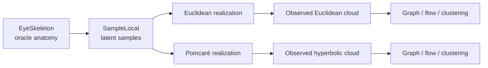

Yes—and I’d treat “maturing the 3D engine” as a distinct design problem from designing the scientific workbench around it.

The current viewer is doing at least four jobs:

1. Rendering geometry.
2. Managing cameras, controls, picking, and visibility.
3. Presenting the user interface.
4. Driving scientific configuration and recomputation.

That mixture is why it feels unruly. The solution is not a more elaborate scene class; it is separating those responsibilities while preserving a very tight interaction loop.

A useful architecture would be:

```text
ThermoMapper artifacts
        ↓
Visualization adapters
        ↓
Visual scene compiler
        ↓
Reusable 3D renderer
        ↕
Interaction system
        ↕
Workbench UI and linked panels
```

The 3D renderer itself should know almost nothing about graphs, Mapper, SPC, GMM, or ground truth. It should understand a reusable visual vocabulary:

- point sets
- line and edge sets
- meshes and triangles
- vector and line fields
- ellipsoids and other glyphs
- text and annotations
- clipping surfaces and boundaries
- coordinate spaces and transforms
- selections, highlights, and visibility groups

An adapter would turn a `GraphBuildResult`, for example, into points, weighted edges, diagnostic edge masks, legends, and pick metadata. That keeps the renderer reusable without throwing away scientific identity.

The most important boundary is between the scientific entity and its rendered representation. A rendered edge should retain a stable reference such as:

```text
artifact: graph/build-17
entity kind: edge
entity key: CSR slot 4812
```

It must not become merely “vertices 27 and 91 in a Three.js line buffer.” Stable identity enables nearly every mature interaction you’ll eventually want: picking, linked selection, inspection, provenance lookup, filtering, highlighting across panels, and incremental updates.

I would divide the client into roughly these systems:

- **Render kernel:** WebGL/Three.js lifecycle, GPU buffers, materials, cameras, resize, disposal, and render scheduling.
- **Visual scene:** Declarative marks, groups, coordinate transforms, styles, visibility, and stable entity references.
- **Interaction services:** Hover, click selection, lasso, brushing, measurements, probing, clipping, and camera manipulation.
- **View controllers:** Spatial view, barcode view, hierarchy view, chart view, report view.
- **Workbench state:** Active artifacts, linked selections, comparison layout, axis cursor, saved views, and presentation progression.
- **Scientific bridge:** Requests real C# operations, tracks jobs, rejects stale results, and inserts returned artifacts into the study.

Three categories of state should remain deliberately separate:

- **Scientific/document state:** datasets, graphs, results, recipes, provenance.
- **View state:** camera, visible layers, color mappings, clipping planes, selected time or temperature.
- **Transient interaction state:** hover target, drag operation, open tooltip, provisional lasso.

Only the first two generally belong in saved sessions. Keeping hover and DOM details out of the scientific document prevents the familiar UI-state swamp.

For interactivity, I would use a command/action model rather than letting widgets directly mutate Three.js objects:

```text
SelectEntities(...)
SetLayerVisibility(...)
SetColorEncoding(...)
SetAxisCursor(...)
FrameSelection(...)
RequestRecipeBranch(...)
CompareArtifacts(...)
```

The renderer reacts to state changes. This gives you reproducible views, undo/redo, keyboard shortcuts, macros, demo progression, and eventually notebook-like history without having to bolt them on afterward.

The UI should be organized around research actions, not around every available parameter. A strong initial shape would be:

- a large direct-manipulation viewport;
- an artifact/layer outline;
- a contextual inspector for the current selection;
- a compact recipe/configuration area;
- optional linked diagnostics below or beside the viewport;
- a provenance trail showing what produced the visible result.

That supports progressive disclosure. Looking at a point cloud remains simple, but selecting an edge can reveal its endpoints, metric distance, kernel weight, CSR slot, graph-health classification, and which downstream results depend on it.

Some especially valuable interaction patterns for ThermoMapper would be:

- Lasso samples and propagate that selection into Mapper nodes, clusters, and associated persistence generators.
- Hover a Mapper node and highlight its member samples.
- Select a persistence bar and reveal its representative cycle in the spatial view.
- Scrub temperature while the spatial partition, SPC curves, and lineage view move together.
- Lock two cameras while comparing graph constructions.
- Toggle between observed and oracle artifacts without changing styling or camera.
- Probe a suspicious edge and compare its metric distance, coupling, alignment, and co-membership.
- Freeze one stage, branch the next stage, and show the divergence side by side.
- Save a view as either a research checkpoint or a step in a curated explanation.

For the rendering implementation itself, a few mature-engine idioms will matter:

- Treat the visual scene as retained, declarative state rather than manipulating scene objects throughout UI handlers.
- Perform incremental “diff and update” compilation rather than rebuilding the scene on every change.
- Use instancing and packed buffers for points, edges, arrows, and glyphs.
- Centralize GPU resource ownership and disposal.
- Use stable object/entity IDs and a dedicated picking subsystem.
- Make coordinate-space conversion explicit.
- Separate geometry from appearance so color, opacity, and selection changes do not rebuild topology.
- Schedule rendering only when dirty, except during animation.
- Define renderer capabilities so specialized renderers—Euclidean, Poincaré, sphere, simplex—can extend the system without infecting every layer with conditionals.
- Keep panel overlays, legends, tooltips, and controls in the UI layer rather than embedding them in the WebGL scene unless spatial anchoring requires it.

I would not build a generic wrapper around all of Three.js. Those abstractions often become a worse, incomplete version of Three.js. Build a narrow visual engine around the operations ThermoMapper actually needs, and allow specialized marks or render passes to use Three.js internally.

Similarly, I would avoid starting with a fully general node editor. Your scientific compositions have constrained semantics. A typed recipe/branch interface can offer partial execution, oracle substitution, sweeps, and frozen stages while preventing nonsensical pipelines.

The current viewer still has value. Its rendering techniques, visual encodings, camera behavior, and controls are prototypes from which to extract requirements. I would progressively hollow it out:

1. Extract stable viewport and renderer lifecycle.
2. Introduce explicit visual-scene objects with stable entity identity.
3. Move controls into external workbench state/actions.
4. Replace domain-specific viewer code with artifact adapters.
5. Add linked selection and a contextual inspector.
6. Add multi-panel comparison and synchronized axes.
7. Retire the embedded regeneration form once typed recipes drive computation.

The resulting division is important:

> The visualization workbench decides what scientific experiment is being inspected. The visual scene compiler decides how its artifacts are represented. The 3D engine renders and interacts with that representation efficiently.

That gives you a genuinely reusable 3D engine, while still allowing the complete system to become highly specialized, interactive, and scientifically expressive.

“Cinematography” is exactly the right word. `EyeTorusToy` is not merely a fixture to display; it is practically the protagonist for the whole workbench. It contains a latent world, an observation process, several geometric realizations, and several opportunities for the method to misunderstand what it sees.

Its actual causal structure is already unusually good:



The eye has three strokes—a full iris torus and asymmetric upper and lower arcs—plus an optional pupil, hierarchical labels, variable cross-sections, taper, jitter, density bias, and a colored-noise background. That is encoded in [EyeSkeleton.cs](D:/aghado01/ThermoMapper/src/synthetic/euclidean/EyeSkeleton.cs:12) and [EyeTorusToy.cs](D:/aghado01/ThermoMapper/src/synthetic/euclidean/EyeTorusToy.cs:9). The hyperbolic version reuses the same local structural samples and changes their realization through the Poincaré exponential map in [HyperbolicEyeTorus.cs](D:/aghado01/ThermoMapper/src/synthetic/manifolds/HyperbolicEyeTorus.cs:33).

That means the eye can support several distinct “films.”

### Film one: Anatomy of a fixture

Open face-on in darkness, with only the clean skeleton visible:

- Draw the central iris as a perfect generating curve.
- Introduce the upper brow and lower bag separately.
- Orbit slightly so their toroidal cross-sections become apparent.
- Reveal shell versus solid versus ribbon profiles.
- Show taper narrowing the half-arcs.
- Add the pupil, if present.
- Accumulate samples along the anatomy.
- Introduce structural jitter.
- Finally let the colored-noise blanket grow around it.

Then strip all of that privileged information away: skeleton gone, construction colors gone, only the unlabeled point cloud remains.

That transition is scientifically important. It says:

> Everything before this moment is how the world was made. Everything after it is what the method is allowed to know.

In exploratory mode the user can move backward and forward through that construction. In a canonical run, the downstream pipeline receives only the observations.

### Film two: The crime of proximity

The eye is nearly purpose-built for explaining why proximity is not the same as intrinsic relationship.

Keep the points fixed and introduce graph construction in stages:

1. Show candidate neighborhood distances around one selected point.
2. Materialize the selected adjacency.
3. Highlight graph edges crossing oracle structure groups.
4. Orbit to reveal which apparent neighbors arise from ambient folding.
5. Compare metrics or graph rules in linked viewports.

The key cinematic discipline is to separate adjacency from coupling:

- First compare which edges exist while holding the kernel fixed.
- Then freeze the adjacency and vary the kernel or bandwidth.
- Encode distance and coupling separately.
- Let a selected edge show the transformation `distance → kernel weight`.

Otherwise a visual transition from one graph to another can misleadingly conflate “different neighbors were selected” with “the same neighbors were coupled differently.”

Oracle labels could turn cross-stroke edges red, but only when the user enables an oracle diagnostic. The normal graph remains untouched. At the coarse hierarchy, the same edge might be signal-to-signal and therefore acceptable; at the fine hierarchy, it could be a brow-to-iris false bridge. The hierarchy-level selector therefore changes the diagnostic question, not the graph.

### Film three: What direction does the eye flow?

This may be the most direct realization of your original intent.

Compute the empirical line or tangent field from the observed cloud and graph. Display that result alone first. Then optionally introduce the generating tangent field from the eye skeleton:

- empirical field as solid glyphs;
- oracle field as thin ghost glyphs;
- angular disagreement as color;
- uncertainty or instability as glyph opacity;
- undefined oracle flow on background points explicitly masked.

The user could select a bad region and ask why the empirical field rotates, splits, or crosses the tube. Then they can change graph construction and watch the field respond.

This is exactly where “cheating” becomes disciplined:

- The empirical producer never sees the skeleton.
- The fixture-specific oracle producer derives a true tangent from the latent stroke parameter.
- A comparison producer calculates their disagreement.
- The renderer merely shows all three artifacts.

The current generator does not yet retain enough information for the best version of this. `SampleLocal` presently discards each point’s stroke parameter `θ`, normalized arc position, cross-section coordinates, pre-jitter position, and noise displacement. The eye skeleton also is not placed in `SyntheticDataset.ClusterGeometries`. A generic adapter currently sees points and labels, but not the full anatomy that generated them.

That suggests an eventual richer fixture result along these lines:

```text
Synthetic case
├── observations
├── stable sample identities
├── generator specification
├── realization provenance
├── oracle hierarchy
├── latent sample coordinates
├── clean and perturbed positions
├── oracle skeleton and tangent frames
└── cross-realization correspondences
```

Those oracle fields should accompany the case, not be mixed into `Features` or exposed automatically to algorithms.

### Film four: Heating the eye

Once the graph is fixed, temperature becomes a genuine scientific time axis:

- Scrub the actual SPC temperature schedule.
- Animate measured affinities and alignments on graph edges.
- Color points by the resulting assignment.
- Keep susceptibility, magnetization, cluster count, and lineage curves synchronized.
- Select a transition in the chart and inspect what changes spatially.
- Toggle oracle labels only as a reference overlay or quantitative score.

The camera should not perform all the explanatory work here. The spatial viewport shows _where_ something happens; the synchronized curves explain _when_ and _how strongly_.

This is also where your distinction between demonstration and diagnosis becomes palpable. A demonstration plays a pinned sweep and pauses at meaningful temperatures. A diagnostic session lets the user probe an unexpected transition, inspect edge currencies, freeze a temperature, and branch into alternative resolution policies.

### Film five: The same eye in different worlds

The Euclidean and hyperbolic generators already share the local structural sample, making a linked comparison unusually powerful:

- Begin with matched local structure.
- Split into Euclidean and Poincaré realizations.
- Keep corresponding structural points linked.
- Render the Poincaré ball boundary explicitly.
- Render graph edges as native geodesic arcs.
- Use `WarpStrength` as a real generative intervention, not a camera effect.
- Compare Euclidean and Poincaré metrics on the appropriate realizations.
- Then contrast the 3D linked eye with its 4D unlinked version through an explicit projection artifact.

One honesty constraint matters: the Euclidean and hyperbolic backgrounds are generated by different processes. The Euclidean eye uses a colored spectral density field, while the hyperbolic eye samples a native ball-volume background. Structural points can morph by correspondence; background points should dissolve and reappear unless a separate matched-background experiment is constructed. Pretending they correspond would make a beautiful but false morph.

Likewise, “4D viewed in 3D” must expose its projection. The fourth coordinate could be encoded by color, size, a projection-control dial, or multiple linked projections. Simply taking the first three coordinates is not enough for this particular story.

### Three timelines, never one

The engine should keep these independent:

- **Pipeline time:** skeleton → observations → graph → flow → SPC.
- **Scientific time:** temperature, filtration value, graph parameter sweep.
- **Cinematic time:** camera moves, fades, progressive reveals, pauses.

A progressive reveal of graph edges is not necessarily an execution trace. It may only be presentation choreography. The system should distinguish those explicitly so a beautiful explanation never quietly becomes a false account of how the algorithm operated.

A useful vocabulary might be:

- **Fixture specification:** the generative model.
- **Take:** one seeded realization and executed experimental branch.
- **Shot:** camera, layers, selection, annotations, and panel layout.
- **Cue:** a transition between shots.
- **Sequence:** ordered shots over one or more takes.

The scientific contracts can retain more sober names, but this mental model cleanly separates generating data, running methods, and directing their explanation.

One scientific audit item surfaced while tracing this: the hyperbolic generator advertises arbitrary dimension, but its background radial density currently uses `sinh²(ρ)` for every dimension. That is the volume factor for three-dimensional hyperbolic space; in dimension \(D\), it should scale as \(\sinh^{D-1}(\rho)\). The 3D eye is unaffected, but that should be corrected before using the 4D background as scientific evidence.

My instinct for the opening is therefore: begin with Domany’s familiar flat eye, let it acquire thickness and become your toroidal creature, reveal how it was generated, and then erase all privileged knowledge. The moment the scaffolding disappears and the first proximity edges appear is where ThermoMapper’s actual story begins.
